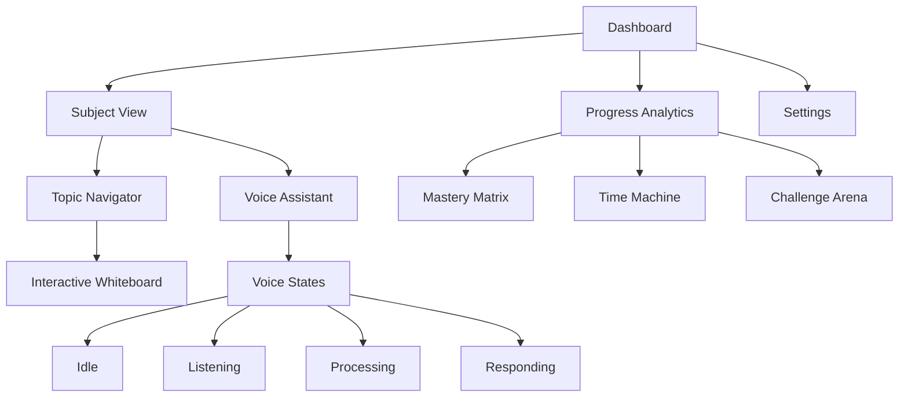

# Koro.ai Frontend: Complete Overhaul Requirements

## 1. Product Overview

Koro.ai is a voice-first educational app that provides interactive learning experiences through gamified interfaces, real-time voice interaction, and immersive visual elements. The platform combines cutting-edge web technologies to create an engaging educational environment that balances playful interaction with pedagogical effectiveness.

### 2.1 User Roles

| Role     | Registration Method | Core Permissions                                                                                 |
| -------- | ------------------- | ------------------------------------------------------------------------------------------------ |
| Student  | Default access      | Can access all learning modules, track progress, interact with voice assistant, customize themes |
| Educator | Admin invitation    | Can create content, monitor student progress, access analytics dashboard                         |

### 2.2 Feature Module

Our Koro.ai frontend consists of the following main pages:

1. **Dashboard Page**: Student learning hub with gamified progress overview, subject cards in Bento grid layout, achievement system
2. **Subject View**: Immersive learning environment with voice assistant, interactive whiteboard, topic navigator
3. **Progress Analytics**: Deep-dive metrics with mastery matrix, session timeline, challenge arena
4. **Settings Page**: Theme customization, accessibility options, voice preferences

### 2.3 Page Details

| Page Name          | Module Name                 | Feature description                                                                                                                                |
| ------------------ | --------------------------- | -------------------------------------------------------------------------------------------------------------------------------------------------- |
| Dashboard Page     | Retractable Sidebar         | Hamburger menu expands to 250px, hover tooltips, persistent state, subjects navigation, quick actions, achievement badges with confetti animations |
| Dashboard Page     | Subject Cards (Bento Grid)  | 3D tilt hover effects, glow pulse animations, progress rings, next topic display, last session info, click navigation to subject view              |
| Dashboard Page     | Progress Dashboard          | Streak counter with fire animation, weekly engagement bar charts, concept mastery heatmap, glassmorphism cards with gradient borders               |
| Subject View       | Collapsible Topic Navigator | Nested accordions for chapters and topics, visual progress indicators (🔴🟡✅), smooth slide-down animations with spring physics                    |
| Subject View       | Voice Assistant Bar         | Four states (Idle/Listening/Processing/Responding), pulsing gradient mic button, real-time waveform visualization, animated soundwaves             |
| Subject View       | Interactive Whiteboard      | Handwriting simulation with Rive animations, dynamic diagram annotations, pinch-to-zoom, slider controls, 3D object rotation                       |
| Progress Analytics | Mastery Matrix              | Interactive radar chart with lazy loading, spring transitions, hover tooltips for topic details                                                    |
| Progress Analytics | Time Machine                | Scrollable session timeline, floating session cards, expandable session replay functionality                                                       |
| Progress Analytics | Challenge Arena             | Gamified weakness conquest, animated physics boss fights, XP gain animations                                                                       |
| Settings Page      | Theme Engine                | Four presets (Quantum, Biohazard, Cosmos), auto-sync with subjects, accessibility toggles                                                          |

## 3. Core Process

**Student Learning Flow:**

1. Student accesses Dashboard → views progress overview and subject cards
2. Selects subject card → navigates to Subject View
3. Uses Topic Navigator → selects specific learning module
4. Interacts with Voice Assistant → asks questions and receives responses
5. Engages with Interactive Whiteboard → manipulates diagrams and simulations
6. Completes session → returns to Dashboard with updated progress
7. Accesses Progress Analytics → reviews detailed learning metrics

**Voice Interaction Flow:**

1. Student taps microphone → Voice Assistant enters Listening state
2. Speech detected → transitions to Processing state with waveform visualization
3. AI generates response → enters Responding state with animated soundwaves
4. Audio complete → returns to Idle state ready for next interaction

## 4. User Interface Design

### 4.1 Design Style

* **Primary Colors**: Electric blue (#0066FF) to violet (#8B5CF6) gradients

* **Secondary Colors**: Neon accents for dark mode, warm tones for light mode

* **Button Style**: Glassmorphism with gradient borders, water ripple effects on press

* **Fonts**: Geist Sans for headings, Geist Mono for code, dynamic scaling support

* **Layout Style**: Bento grid system, floating animations, 3D tilt effects

* **Animation Style**: Framer Motion for micro-interactions, Rive for educational content, spring physics

* **Icons**: Lucide icons with particle explosion effects for notifications

### 4.2 Page Design Overview

| Page Name    | Module Name        | UI Elements                                                                                                                         |
| ------------ | ------------------ | ----------------------------------------------------------------------------------------------------------------------------------- |
| Dashboard    | Subject Cards      | Glassmorphism cards with electric blue to violet gradients, 3D hover tilt, progress rings with D3 animations, floating badge system |
| Dashboard    | Sidebar            | 250px expanded width, hover tooltips, persistent localStorage state, achievement badges with confetti particles                     |
| Subject View | Voice Assistant    | Pulsing gradient circle, real-time Wavesurfer.js waveforms, animated soundwave visualizations, four distinct visual states          |
| Subject View | Whiteboard         | Rive handwriting animations, dynamic force vector annotations, WebGL 3D rotations, pinch-zoom interactions                          |
| Analytics    | Data Visualization | Tremor charts with spring transitions, interactive radar charts, floating timeline cards, battle map aesthetics                     |
| Settings     | Theme Engine       | Four preset themes with auto-subject sync, accessibility toggles, reduced motion options                                            |

### 4.3 Responsiveness

Desktop-first design with mobile-adaptive layouts, touch interaction optimization for whiteboard and voice controls, collapsible sidebar behavior on mobile devices.

## 5. Technical Implementation

### 5.1 Core Tech Stack

* **Framework**: React + TypeScript for component reusability and type safety

* **Styling**: Tailwind CSS + ShadCN UI for rapid development

* **Animations**: Framer Motion + Rive for micro-interactions and educational content

* **Physics**: Matter.js + React-Konva for interactive simulations

* **Voice**: Wavesurfer.js for real-time waveform visualization

* **Charts**: Tremor + D3 for engaging data visualization

* **Layout**: React Resizable Panel for collapsible sidebar

### 5.2 Implementation Phases

**Phase 1: Core Framework**

* Setup React + Tailwind + ShadCN foundation

* Implement resizable panel system

* Build Bento grid component system

**Phase 2: Subject View**

* Voice assistant bar with Wavesurfer integration

* Topic navigator with Rive animations

* Interactive whiteboard with Matter.js physics

**Phase 3: Dashboard**

* Progress rings with D3 visualizations

* Animated KPIs using Tremor

* Achievement badge system with particle effects

**Phase 4: Polish**

* Theme engine with four presets

* Micro-interactions with Framer Motion

* Mobile responsiveness optimization

### 5.3 Performance Targets

* **FID**: < 100ms for interactive elements

* **LCP**: < 1.5s for initial page load

* **Accessibility**: WCAG 2.1 AA compliance

* **Lighthouse Score**: 95+ overall rating

### 5.4 Engagement Metrics

* **Session Duration**: > 18 minutes average

* **Daily Active Usage**: > 70% retention

* **Voice Interaction**: Seamless real-time processing

* **Animation Performance**: 60fps for all interactions

